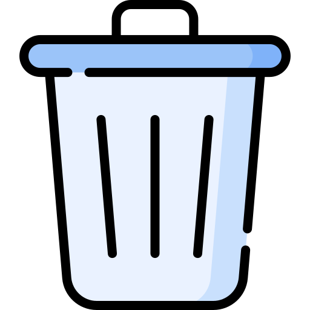

# TRASH

Trash is a program created using a shell language to move files to the trash folder, so they are not immediately deleted.

Note : I created this program so that I can delete files in Termux, which doesn't have a desktop environment, without deleting them directly.

## the technology used is
- Shell
- LunarVim

## How to install
- Comming soon

## How to use
'''
// help or more command
trash -h

// delete file/dir to trash folder
trash del <file/dir>

// cleaning trash folder
trash empty
'''

## How to uninstall
- Comming soon

Thanks for reading...!
